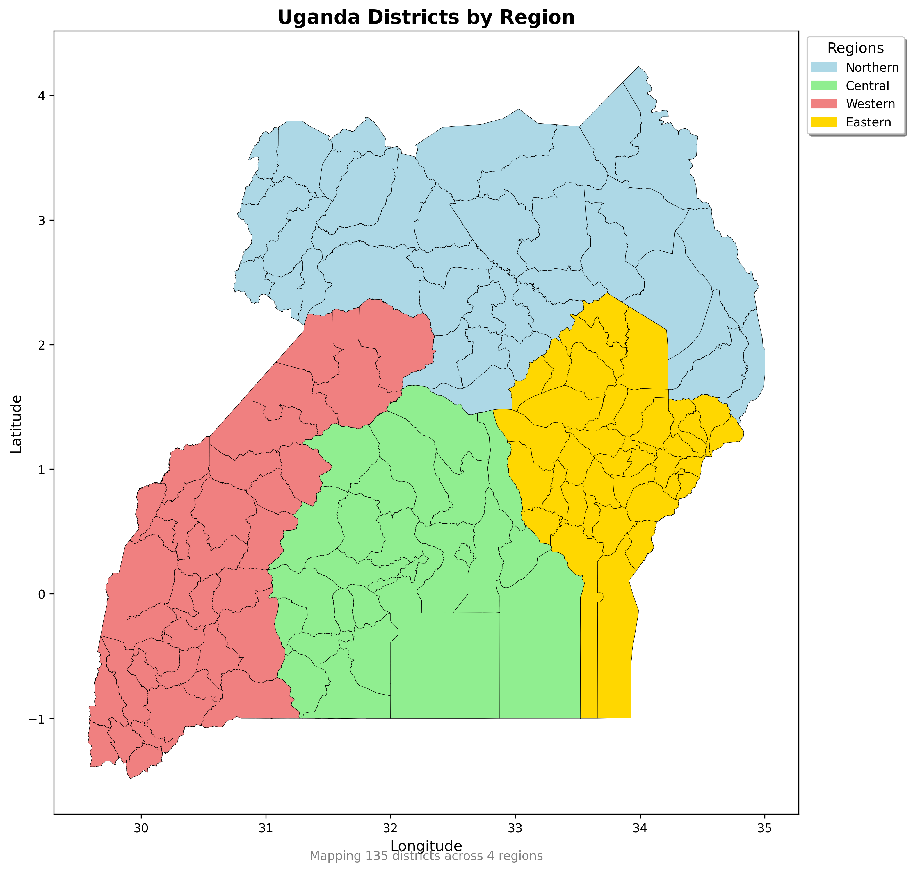
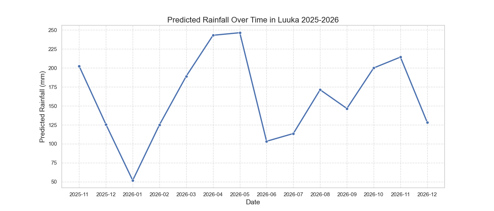
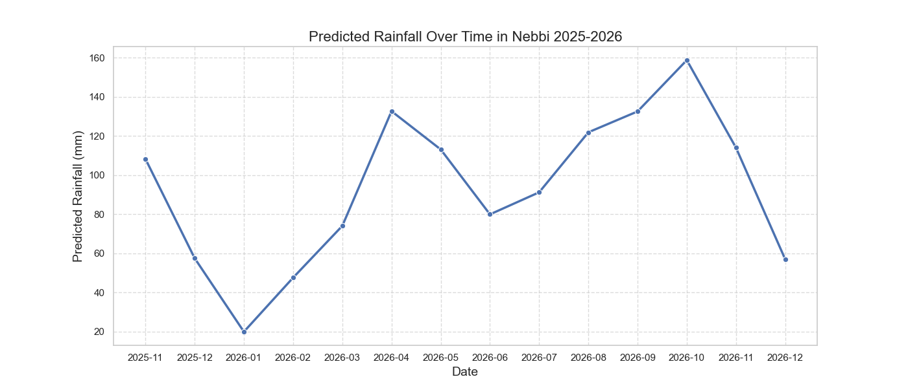
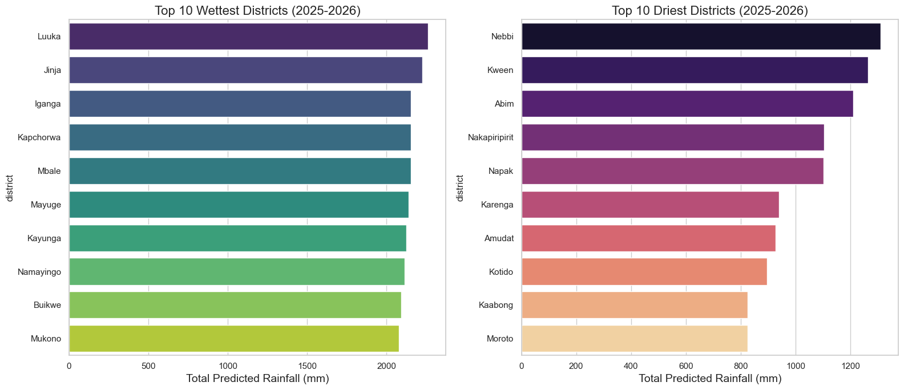

# **Uganda Districts' Rainfall Prediction using Machine Learning**

## 1. **The Problem Identification**

### The Problem

Uganda’s economy and food security are fundamentally tied to rain-fed agriculture,
 making the country highly sensitive to climate variability. The recent Uganda
  National Meteorological Authority (UNMA)
  outlook predicts "above-normal" (enhanced) rainfall for the SOND 2025 season
   across most of the country. While increased rainfall is generally beneficial,
    this excess introduces critical risks that farmers are currently unprepared
     for, including water logging, nutrient leaching, and significant post-harvest
      losses due to poor drying conditions.

In specific high-risk zones like the Elgon and Kigezi sub-regions, this enhanced
 rainfall threatens crop destruction through landslides and flash floods. The core
  issue is that without precise, district-level predictions, farmers lack the
   granular data needed to effectively time planting or prepare drainage infrastructure
    to mitigate these specific local excesses.

### **Research Question**

> **Can we use historical ERA5 climate data and Climate Hazards data (CHIRPS) to**
**generate granular, district-level rainfall forecasts that allow farmers to**
**anticipate and mitigate the risks of "above-normal" rainfall events?**

### Domain Knowledge

*Based on the [UNMA SOND 2025 Seasonal Rainfall Outlook](https://meteo.mwe.go.ug/media/downloads/files/September%20to%20December%20(SOND)%202025%20Seasonal%20Rainfall%20Outlook%20(1)_compressed.pdf):*

- **Key Risk 1: Agronomic Instability:** The forecasted "above-normal" rains
 pose a high risk of soil nutrient leaching and water logging, which can rot root
  crops like beans and cassava if drainage is not managed.
- **Key Risk 2: Post-Harvest Loss:** Continuous heavy rains during harvest periods
 create poor drying conditions, leading to mold and storage losses for cereal crops.
- **System View (Geographic Vulnerability):** The impact is not uniform; mountainous
 regions (Elgon, Kigezi, Rwenzori) face physical destruction of farmland via landslides,
  while urbanizing areas face flash floods.
- *[Link to full Domain Research in `/0_domain_research`](https://github.com/GaiSamuel/MIT_Emerging_Talent_ELO2-Uganda-Districts-Rainfall-Prediction-Using-Machine-Learning/blob/main/0_domain_study/0_domain_research.md)*

---

## 💾 2. Data Strategy

> 

### Modeling the World

To capture the complexity of Uganda's climate, we adopted a **multi-source data
 strategy**, combining high-resolution satellite rainfall data with broad
  atmospheric reanalysis models. We aggregate this data spatially using official
   administrative boundaries to create a **District-Level Time Series** for every
    district in Uganda.

**Possible Flaws in this Approach:**

- **Satellite vs. Ground Truth:** We rely on **ERA5 Reanalysis data**
 (satellite + simulation). While globally consistent, it may miss "micro-climate"
  events (like a sudden storm on one specific hill) that a physical rain gauge
   would catch.
- **Climate Change Shifts:** Our model learns from history. If climate change
 causes a fundamentally *new* weather pattern (e.g., the permanent disappearance
  of the dry season), our historical model may struggle to adapt immediately.
- **Missing Districts:** 15 districts (e.g., Kampala) had significant
 structural missing data in the raw source and had to be excluded.
- **The Temperature, Rainfall and Surface Pressure Gap:** Some of our districts
 had missing temperature values from 1988–1999 and surface pressure values for
  2024 which we filled using averages, and the missing CHIRPS rainfall data was
   imputed by scaling ERA5 precipitation values using a calculated conversion
    ratio to ensure complete coverage for all districts. This smoothes out
     historical volatility, potentially causing the model to miss extreme
      weather events or specific anomalies that occurred during those periods.

**Data Sources:**

1. **CHIRPS (Rainfall):** *Climate Hazards Group InfraRed Precipitation with
 Station data*. We use this as our "Ground Truth" for rainfall because it blends
  satellite imagery with actual station data, providing high accuracy for African
   regions.
1. **ERA5 (Climate Drivers):** *ECMWF Reanalysis v5*. We use this for atmospheric
 drivers (Temperature, Pressure, Wind, Cloud Cover) that influence rainfall patterns.
1. **UBOS Shapefiles:** Official Uganda Bureau of Statistics district boundaries
 (2020) used to spatially aggregate the gridded climate data.

### The Datasets

We have produced two primary clean datasets for this project, available in the
 [`clean_data/`](https://github.com/GaiSamuel/MIT_Emerging_Talent_ELO2-Uganda-Districts-Rainfall-Prediction-Using-Machine-Learning/blob/main/1_datasets/clean_data)
  folder:

#### 1. Historical Climate Data (Training Set)

- **File:** [`uganda_monthly_rainfall_and_climate_variables_1981_2025.csv`](https://github.com/GaiSamuel/MIT_Emerging_Talent_ELO2-Uganda-Districts-Rainfall-Prediction-Using-Machine-Learning/blob/main/1_datasets/clean_data/uganda_monthly_rainfall_and_climate_variables_1981_2025.csv)

- **Description:** The master dataset used to train our machine learning models.
 It contains 44 years of cleaned, merged, and spatially aggregated climate indicators.
- **Reproducible using:** [`cleaning_script`](https://github.com/GaiSamuel/MIT_Emerging_Talent_ELO2-Uganda-Districts-Rainfall-Prediction-Using-Machine-Learning/blob/main/2_data_preparation/cleaning_script/merge_datasets.ipynb)
- **Dimensions:** ~64,560 Rows, 10 Columns.
- **Key Variables:** `rainfall_mm` (Target), `temperature`, `dewpoint_temperature`,
 `surface_pressure_pa`, `wind_u_component`, `wind_v_component`, `total_cloud_cover`.

#### 2. Future Forecast Data (Prediction Set)

- **File:** [`uganda_rainfall_forecasts_2025_2026.csv`](https://github.com/GaiSamuel/MIT_Emerging_Talent_ELO2-Uganda-Districts-Rainfall-Prediction-Using-Machine-Learning/blob/main/1_datasets/clean_data/uganda_rainfall_forecasts_2025_2026.csv)

- **Description:** The output of our Random Forest model. It contains the
 14-month recursive forecast for every district.
- **Reproducible using:** [data_analysis.ipynb](https://github.com/GaiSamuel/MIT_Emerging_Talent_ELO2-Uganda-Districts-Rainfall-Prediction-Using-Machine-Learning/blob/main/4_data_analysis/data_analysis.ipynb)
- **Dimensions:** ~1680 Rows, 4 Columns.
- **Timeline:** November 2025 – December 2026.
- **Key Variables:** `district`, `region`, `date`, `predicted_rainfall_mm`.

### Data Processing Pipeline

Our [raw](https://drive.google.com/drive/folders/16Q1MUI4KG64qhDLebSWlTlJxiJwDZxZS)
 data processing is reproducible using the scripts in
  [`extracting_raw_data_scripts/`](https://github.com/GaiSamuel/MIT_Emerging_Talent_ELO2-Uganda-Districts-Rainfall-Prediction-Using-Machine-Learning/blob/main/2_data_preparation/extracting_raw_data_scripts)
   folder to produce the [raw datasets](https://github.com/GaiSamuel/MIT_Emerging_Talent_ELO2-Uganda-Districts-Rainfall-Prediction-Using-Machine-Learning/blob/main/1_datasets/raw_data)
    in `csv` and `shapefile`.

**1. Spatial Aggregation (Zonal Statistics):**

- **CHIRPS:** We iterated through raster files and used `rasterstats` to
 calculate the mean rainfall pixels falling within each district polygon.
- **ERA5:** We read GRIB files using `xarray`, converted grid points to geometry
 objects, and performed a **Spatial Join** (`gpd.sjoin`) with the district shapefile
  to compute precise regional averages.

**2. Merging & Harmonization:**

- All 7 distinct climate variables were merged on `District`, `Region`, and `Date`.
- **Unit Conversion:** Kelvin temperatures were converted to Celsius; Pressure
 converted to Pascals.
- **Data Rescue:** We identified districts missing CHIRPS data and successfully
 imputed their values using a calculated conversion ratio from the ERA5 Precipitation
  dataset.

---

## 3. 📈 Data Analysis & Modeling

**Goal:** This folder contains the machine learning pipeline used to predict
 district-level rainfall in Uganda for the 2025–2026 period.

> **Methodology:** We treat this as a **Time-Series Regression** problem. By
 training a model on 44 years of historical climate data (1981–2018), we identify
  patterns in seasonality, trends, and atmospheric drivers to forecast the
   future (2019–2025 validation + 2026 prediction).

---

## 1. Why Trust This Model?

*A non-technical explanation of why these results are reliable.*

If you are a farmer, policy-maker, or district planner, you need to know if you
 can rely on these numbers. Here is why this model is trustworthy:

1. **✅ It Knows the Seasons (Validated Physics):**
    First, we checked if the model understands Uganda's climate. A bad model might
     predict heavy rain in January or a drought in April. **Our model successfully
      reproduces the 'Double Rainy Season' pattern** March-April-May(MAM) and
       September-October-November(SON) that every Ugandan farmer knows. Because
        it captures these fundamental cycles correctly, we know it is learning
         from reality, not guessing.

   
   

2. **✅ It Beats the "Safe Bet" (36% Accuracy Boost):**
    If you had to guess rainfall without this model, your best bet would be to
     use the historical average. Our model reduces the error of that "average guess"
      by **over 36%**. It doesn't just look at the calendar; it looks at specific
       atmospheric conditions to give a sharper prediction.

3. **✅ It Has "Memory":**
    Rainfall isn't random, it is "sticky." If it rains heavily in October, the
     soil moisture often carries over into November. We taught this model to have
      a memory. It looks at the last 90 days of history to adjust the forecast
       up or down based on recent trends.

4. **✅ It Respects Local Differences:**
    It does not treat Uganda as one block. It correctly identifies that districts
     in the Lake Victoria Basin are naturally wetter and that districts in the Karamoja
      region are naturally drier. It generates a unique forecast for every single
       district based on that district's unique history.
    
    
    

---

## 2. Analysis Strategy (Technical)

Our approach balances complexity with interpretability, using a tree-based
 ensemble method that handles non-linear climate interactions well.

### 🧠 The Model: Random Forest Regressor

We selected **Random Forest** over simpler linear models because:

- **Non-Linearity:** Rainfall drivers (like El Niño or pressure systems) don't
 have simple linear relationships with precipitation.
- **Interaction:** It captures complex interactions between variables (e.g.,
 how High Temperature + Low Wind = Convection Rain).
- **Robustness:** It is less sensitive to outliers, which is crucial for noisy
 weather data.

### 🔄 Data Batching & Validation Strategy

*How we ensured the model predicts the future, not the past.*

1. **Training Batch (The Past):**
    - **Period:** Jan 1981 – Dec 2018 (38 years)
    - **Purpose:** The model learns long-term climate trends, seasonal cycles
   (MAM/SON), and physical relationships between variables (e.g., how temperature
    affects rainfall).
    - **Size:** ~85% of the total dataset.

2. **Validation Batch (The "Future"):**
    - **Period:** Jan 2019 – Oct 2025 (7 years)
    - **Purpose:** We test the model on this unseen "future" data to simulate
   real-world forecasting. If the model can accurately predict the 2020 floods
    using only data from before 2019, we know it is robust.
    - **Size:** ~15% of the total dataset.

**Why this matters:**
This approach mimics the real-world constraint where we only have data up to
 Oct 2025 and need to predict Nov 2025 onwards. It prevents **Data Leakage** and
  ensures our accuracy metrics (RMSE) reflect true predictive power.

### 🛠 Feature Engineering

To turn raw dates into learnable patterns, we created three categories of features:

1. **Temporal:** `Year` (Trend), `Month` (Seasonality), and One-Hot Encoded `Seasons`
 (MAM, SON, etc.).
2. **Autoregressive (Lags):** `rain_lag_1` (Last month's rain) and `rain_lag_3`.
 *Hypothesis: Wet soil leads to more rain.*
3. **Moving Averages:** `rainfall_rolling_mean_3` (Quarterly trend). *Hypothesis:
 Smooths out daily noise to show the "wetness state" of the region.*

> **⚠️ Leakage Prevention:** All rolling means were calculated using `.shift(1)`
> to ensure the model never sees the target month's data when making a prediction.

---

## 3. Model Performance (Results)

We validated the model using a **Time-Based Split**, training on 1981–2018 and
 testing on 2019–2025. This ensures we are testing the model's ability to predict
  the *future*, not just fill in gaps.

<!-- markdownlint-disable MD013 -->
| Metric | Value | Interpretation |
| :--- | :--- | :--- |
| **RMSE** | **~43.2 mm** | On average, our prediction is off by 43mm. |
| **Baseline RMSE** | **~68.1 mm** | If we just guessed the "average", we'd be off by 68mm. |
| **Improvement** | **+36%** | Our model is 36% more accurate than random guessing. |
| **R² Score** | **~0.60** | The model explains 60% of the variance in rainfall. |
| **Pseudo-Accuracy**| **~75%** | Predictions are generally within 25% of the true value. |
<!-- markdownlint-enable MD013 -->
---

## 4. Forecasting Strategy (The Future)

Since we don't have future weather data to feed the model, we used a
 **Recursive Forecasting** strategy for Nov 2025 – Dec 2026.

1. **Step 1:** Predict Month $t$ using known history.
2. **Step 2:** Use the *prediction* from Month $t$ as the "Lag 1" input for
 Month $t+1$.
3. **Step 3:** Repeat for 14 months.
4. **Static Features:** For atmospheric drivers (Temp, Wind, Pressure), we used
 **Climatological Means** (historical monthly averages) as proxies for the future
  state.

---

## 5. Notebooks & Scripts

<!-- markdownlint-disable MD013 -->
<!-- markdownlint-disable MD033 -->
| File | Description |
| :--- | :--- |
| **[`data_analysis.ipynb`](https://github.com/GaiSamuel/MIT_Emerging_Talent_ELO2-Uganda-Districts-Rainfall-Prediction-Using-Machine-Learning/blob/main/4_data_analysis/data_analysis.ipynb)** | **The Core Pipeline.**  1. Loads clean data. 2. Generates Lag/Rolling features. 3. Splits data by Time (Train < 2019). 4. Trains the Random Forest. 5. Generates the 14-month recursive forecast. |
| *[`raw_data_exploration.ipynb`](https://github.com/GaiSamuel/MIT_Emerging_Talent_ELO2-Uganda-Districts-Rainfall-Prediction-Using-Machine-Learning/blob/main/3_data_exploration/raw_data_exploration.ipynb)* | *Pre-analysis visualization of historical trends (See Exploration folder).* |
| *[`predicted_data_exploration.ipynb`](https://github.com/GaiSamuel/MIT_Emerging_Talent_ELO2-Uganda-Districts-Rainfall-Prediction-Using-Machine-Learning/blob/main/3_data_exploration/predicted_data_exploration.ipynb)* | *Post-modeling validation. Visualizes the 14-month forecast to confirm seasonality (bimodal pattern), spatial distribution (wettest vs. driest districts), and regional consistency.* |
|*[`district_graphs.ipynb`](https://github.com/GaiSamuel/MIT_Emerging_Talent_ELO2-Uganda-Districts-Rainfall-Prediction-Using-Machine-Learning/blob/main/3_data_exploration/district_graphs.ipynb)*|Generates visuals for predicted rainfall trend for each district (see exploration folder)|
<!-- markdownlint-enable MD033 -->
<!-- markdownlint-enable MD013 -->

### 6. ⚠️ Possible Flaws

*Sources of error and limitations:*

1. **Recursive Drift:** We predict 14 months into the future. To do this, we use
 Month 1's prediction to predict Month 2. If Month 1 is wrong, that error
  propagates and grows by Month 14.

---

## 📢 4. Communication Strategy

### 🎯 Target Audience

We have identified three primary user groups who need actionable climate intelligence:

<!-- markdownlint-disable MD033 -->
<!-- markdownlint-disable MD013 -->
| Persona | Needs | The "So What?" |
| :--- | :--- | :--- |
| **The Smallholder Farmer** *(e.g., "Farmer Joyce")* | Needs to know *when* to plant and *what* seed variety to use. | If she plants beans during a predicted flood month, she loses her entire harvest to root rot. |
| **The District Planner** *(e.g., "Local Govt Officer")* | Needs to budget for road maintenance and fertilizer subsidies. | If he knows Elgon region faces landslides in October, he can pre-position road-clearing equipment. |
| **The Disaster Manager** *(e.g., "Red Cross Volunteer")* | Needs early warning for floods/droughts to save lives. | Knowing that Ntoroko faces a drought in 2026 allows for early food relief planning. |
<!-- markdownlint-enable MD013 -->
<!-- markdownlint-enable MD033 -->

### 🗣 The Artifact: Interactive Rainfall Website

We chose to build a **Web-Based Dashboard** (HTML/JS) as our primary
 communication artifact.

**Justification:**

1. **Accessibility:** A website can be accessed on a smartphone by extension
 workers and district officers in the field.
2. **Interactivity:** A static report is overwhelming. A search bar allows a
 user to find *their* specific district immediately.
3. **Action-Oriented:** The website doesn't just show charts; it translates data
 into specific advice (e.g., *"Delay planting beans"*), bridging the gap between
  "Data" and "Knowledge."

### 🔑 Key Messages

1. **Uncertainty is Normal:** We communicate forecast ranges (e.g., "Moderate Risk")
 rather than absolute certainties to manage expectations.
2. **Geography Matters:** The forecast for the North is totally different from the
 Central region. Localized data is better than national averages.
3. **Prepare, Don't Panic:** The goal is resilience. Knowing a drought is coming
 is an opportunity to plant drought-resistant crops like Cassava.

### 🔗 Link to Artifact

[`Deployed Interactive Artifact`](https://gaisamuel.github.io/MIT_Emerging_Talent_ELO2-Uganda-Districts-Rainfall-Prediction-Using-Machine-Learning/)

---

### 🔗 Link to the Presentation

[`Presentation Slides`](https://docs.google.com/presentation/d/11pWMljuWkiJGVz9eNaBLPopMQV3oU8z6Wm-jBG83Tec/edit?slide=id.g3ae40e20a8a_0_8#slide=id.g3ae40e20a8a_0_8)

---

If you are interested in contributing to our project, check out the [contributing](https://github.com/GaiSamuel/MIT_Emerging_Talent_ELO2-Uganda-Districts-Rainfall-Prediction-Using-Machine-Learning/blob/main/CONTRIBUTING.md)
 file to  find out how to do so.
